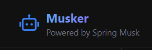

# Musker - Experimental AI Chatbot Project



> **🎓 Learning Project Disclaimer:** 
> This project was created purely for learning and experimentation purposes. It represents my journey in understanding AI integration, authentication, and full-stack development. The code may be unorganized, contain bugs, and not follow best practices. I'm sharing it openly to document my learning process and perhaps help others learn from both my successes and mistakes.

Musker is an experimental, open-source AI chatbot platform that explores the integration of Cloudflare Workers AI for chat and image generation capabilities, with authentication and data persistence using Supabase.

**⚡ Zero Cost Setup:** The entire project can be hosted completely free with just a Cloudflare account

> **⚠ Development Status:** 
> - Backend code is currently being refactored and will be published soon
> - Database schemas documentation is in progress
> - This is a work in progress and may contain significant bugs or security issues
> - Not recommended for production use

## What I Built

- 🤖 Basic AI chat functionality using Cloudflare Workers AI
- 🎨 Experimental image generation features
- 🔐 User authentication implementation with Supabase
- 💾 Basic chat history persistence
- 🎯 Support for multiple chat sessions
- 📱 Responsive design (mobile-first approach)
- ⚡ Integration with Cloudflare Workers for serverless deployment

## Technology Exploration

This project helped me learn:

- **Frontend**: React + TypeScript + Vite
- **Styling**: TailwindCSS
- **Authentication**: Supabase Auth
- **Database**: Supabase PostgreSQL
- **AI Integration**: Cloudflare Workers AI
- **Deployment**: Cloudflare Pages

## Live Demo
- **Experimental Site**: [Musker.pages.dev](https://musker.pages.dev/)
- Note: This is a development version and may be unstable

## Development Setup

### Prerequisites

- Node.js 18+
- npm or yarn
- Supabase account (free tier works)
- Cloudflare account (free tier works)

### Local Setup

1. Clone the repository:
```bash
git clone https://github.com/springmusk026/Musker.git
cd musker
```

2. Install dependencies:
```bash
npm install
```

3. Configure Environment Variables:
- Rename `.env.example` to `.env`
```env
VITE_WORKER_URL=your_cloudflare_worker_url
VITE_SUPABASE_URL=your_supabase_project_url
VITE_SUPABASE_ANON_KEY=your_supabase_anon_key
```

4. Start development server:
```bash
npm run dev
```

## Project Structure

```
musker/
├── src/
│   ├── api/          # API integration attempts
│   ├── components/   # React components (needs organization)
│   ├── hooks/        # Custom React hooks (experimental)
│   ├── styles/       # Global styles
│   └── types/        # TypeScript types (work in progress)
├── public/           # Static assets
```

## Known Issues & Limitations

- Code organization needs significant improvement
- Security measures may be incomplete
- Error handling is basic and needs enhancement
- Documentation is sparse and needs improvement
- Testing is minimal to non-existent
- Performance optimizations haven't been implemented

## Contributing

While this started as a personal learning project, I welcome contributions that could help improve it! However, please note that this is very much a work in progress.

If you'd like to contribute:

1. Fork the repository
2. Create your feature branch (`git checkout -b feature/improvement`)
3. Commit your changes (`git commit -m 'Add some improvement'`)
4. Push to the branch (`git push origin feature/improvement`)
5. Open a Pull Request with detailed description of changes

## Learning Resources

During this project, I learned from:
- [Cloudflare Workers AI Documentation](https://developers.cloudflare.com/workers-ai/)
- [Supabase Documentation](https://supabase.com/docs)
- [React Documentation](https://reactjs.org/)
- [TailwindCSS Documentation](https://tailwindcss.com/docs)

## License

This project is licensed under the MIT License - see the [LICENSE](LICENSE) file for details.

## Contact & Support

- Created by Spring Musk - [@springmusk026](https://github.com/springmusk026)
- Project Link: [https://github.com/springmusk026/Musker](https://github.com/springmusk026/Musker)

Feel free to [open an issue](https://github.com/springmusk026/Musker/issues) if you find bugs or have suggestions for improvements. Remember, this is a learning project, so constructive feedback is always welcome!

---
[](https://dartnode.com "Powered by DartNode - Free VPS for Open Source")
⚠️ **Final Note:** This project was built as part of my learning journey. It may not follow all best practices and could contain security vulnerabilities. Feel free to learn from it, but please use caution if you plan to build upon it.
